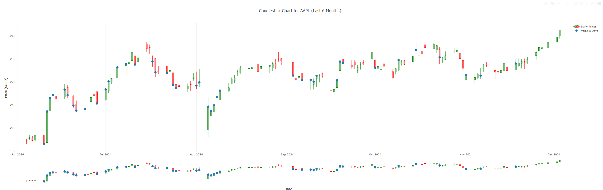

---
# Stock Monitor 📈

A Rust-based command-line application to fetch and visualize stock market data, including candlestick charts with highlighted volatile days. The app uses the Yahoo Finance API to retrieve stock quotes and Plotly for interactive chart generation.
---

## Features

- Fetches historical stock data for the last 6 months.
- Generates an interactive candlestick chart in HTML format.
- Highlights volatile trading days (days where the high-low spread is greater than 2% of the close price).

---

## Getting Started

### Prerequisites

- **Rust**: Install [Rust](https://www.rust-lang.org/tools/install).

### Installation

1. Clone this repository:

   ```bash
   git clone https://github.com/kooner27/stock-monitor.git
   cd stock-monitor
   ```

2. Install dependencies:

   ```bash
   cargo build
   ```

3. Run the application:

   ```bash
   cargo run -- --ticker AAPL
   ```

   Or, if you don't provide a `--ticker`, the program will prompt you to input one interactively.

---

## Example Output

Plotly will generate an interactive html file.
Open it with a browser or your favourite html viewer.
Below is a snapshot for **AAPL** stock (last 6 months):



---

## Usage

### Command-line Arguments

- `--ticker <TICKER>`: Specify the stock ticker symbol (e.g., AAPL, TSLA). If omitted, the application will prompt for it.

### Output

- The application generates an HTML file containing an interactive chart, saved in the format `<ticker>_stock_chart.html`.

---

## How It Works

1. **Fetch Stock Data**: Retrieves historical data using the Yahoo Finance API.
2. **Process Data**: Converts the quotes into candlestick chart data.
3. **Highlight Volatility**: Identifies volatile trading days based on price movements.
4. **Generate Chart**: Creates an interactive HTML chart using Plotly.

---

## Development

### Folder Structure

- `src/main.rs`: Main application logic.
- `Cargo.toml`: Dependency management.

### To Do

- Enhance volatile day criteria.
- Add more charting options.
- Real time tracking.

---

## License

This project is licensed under the MIT License. See the [LICENSE](LICENSE) file for details.

---
